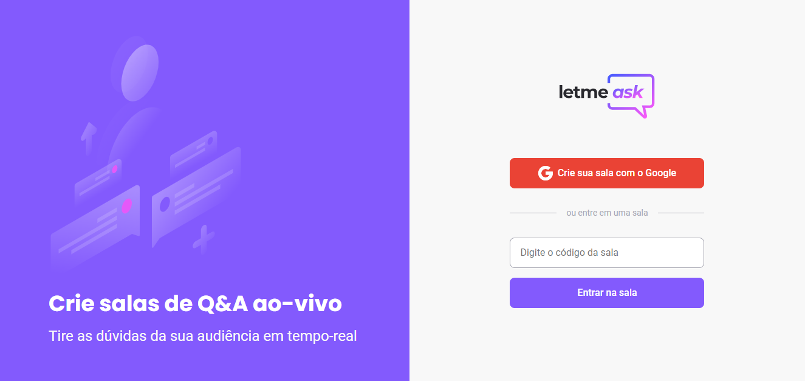

 
💬 Letmeask is a project developed at event Next Level Week # 6 of Rocketseat.

 

## 🚀 OBJECTIVES
This application aims to facilitate the tracking of questions.

## 💻 TECHNOLOGIES

 * React
 * Typescript
 * SASS
 * NodeJS
 * Firebase

## 📝LICENSE
This repository is under the license of [MIT LICENSE](LICENSE).  
